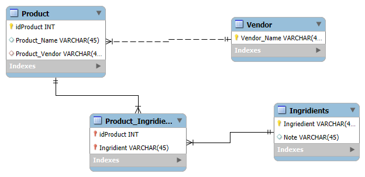

# product_ingredients V 0.0
---
## Why I am creating this
I have had issues with skin care products for years now. If I apply some skin care products on my face, it burns.
So now I'm creating a DB to analyze what ingredient is making my face burn, by collecting all the products & their ingredients
and seeing what they have in common. This would also keep track of what products I can't use.

## Database Design

## Why Java
I want to be able to just have a text file with the product name, vendor, and ingredients, let my program read that file
and create a new entry in the database.

## Small Start

What I want this program to do:
- process text file to sql inputs
- be able to identify the most common ingredient
- tag ingredient that might be causing burning sensation (inflammation)
  - no tag table and no tag-ingredient relationship

## *MySQL JDBC Driver* vs *Hibernate ORM Framework*
I am first just gonna use *MySQL JDBC Driver* and then the *Hibernate ORM Framework*.
Therefore the file structure:
*src/main/JDBC/..*
    - has JDBC Driver code
    - separate "main" function

*src/main/hibernate/..*
    - same, but with hibernate ORM framework code
## Version 0.0
- design stage
## Version 1.0
- will be creating table classes with the according attributes/relationship
## Version 2.0
- reading a text files and extrapolating multiple new objects of different class from it
